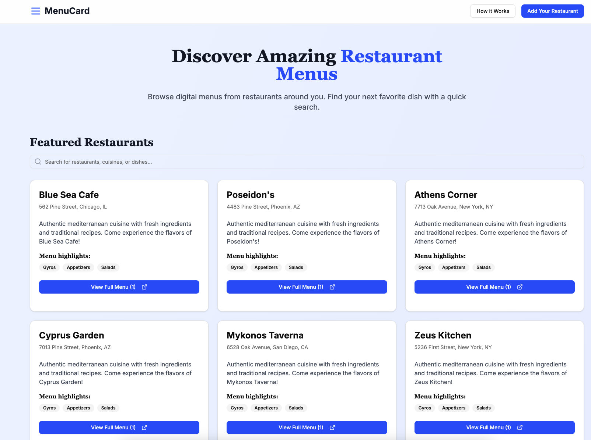
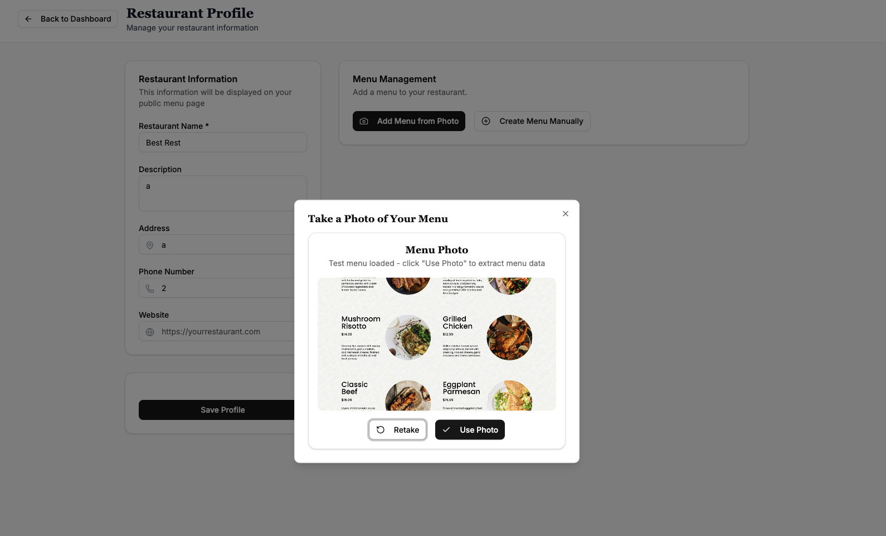
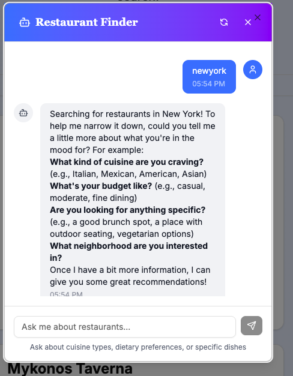

# 🍽️ Online Menu Card - AI-Powered Restaurant Menu Digitization

<div align="center">


**Transform your restaurant menu from photo to digital in seconds using AI! 📸✨**

[🚀 Live Demo](https://online-menu-card-gplbcna0c-bhanuchaddhas-projects.vercel.app/) • [📖 Documentation](#documentation) • [🤝 Contributing](#contributing)

</div>

## 📸 App Screenshots

<div align="center">

### 🏠 Homepage - Modern Landing Experience


*Clean, modern interface showcasing the power of AI-driven menu digitization*

### 📱 Menu Upload - AI-Powered Extraction


*Simply upload a photo of your menu and watch AI extract all items, prices, and descriptions*

### 🤖 AI Chatbot - Intelligent Menu Assistant


*Interactive AI chatbot helps customers find exactly what they're looking for*

</div>

## 🎬 Quick Demo

> **Try it yourself!** Visit the [live demo](https://online-menu-card-gplbcna0c-bhanuchaddhas-projects.vercel.app/) and experience the magic of AI-powered menu digitization.

**🚀 Quick Start Flow:**
1. **Sign in** with your Google account
2. **Upload** a menu photo (or use the sample menu)
3. **Watch** AI extract all menu items automatically
4. **Customize** your digital menu with beautiful themes
5. **Share** your menu with customers via QR code

---

## 🌟 What Makes This Project Special?

This isn't just another menu app - it's a **complete learning playground** showcasing modern web development with cutting-edge AI integration! Perfect for developers who want to understand:

- 🧠 **LLM-based Image Parsing** with OpenRouter
- 🔐 **Google OAuth Authentication** with NextAuth.js
- 🗄️ **Supabase Integration** with Prisma ORM
- 📱 **Progressive Web App (PWA)** development
- 🎨 **Modern UI/UX** with Tailwind CSS & Radix UI
- 🌍 **Full-Stack TypeScript** development

## 🎯 Key Features

### 🤖 AI-Powered Menu Extraction
- **Smart Image Recognition**: Upload a menu photo and watch AI extract all items, prices, and descriptions
- **Multiple LLM Support**: Powered by OpenRouter with access to GPT-4, Claude, Gemini, and more
- **Intelligent Parsing**: Handles various menu formats, languages, and layouts

### 🔐 Seamless Authentication
- **Google OAuth Integration**: One-click login with Google accounts
- **Secure Session Management**: JWT-based authentication with NextAuth.js
- **User Profile Management**: Complete user data handling

### 🗄️ Modern Database Architecture
- **Supabase PostgreSQL**: Cloud-native database with real-time capabilities
- **Prisma ORM**: Type-safe database operations with auto-generated types
- **Optimized Queries**: Efficient data fetching with proper indexing

### 📱 Progressive Web App
- **Mobile-First Design**: Responsive across all devices
- **Offline Capabilities**: Works without internet connection
- **App-Like Experience**: Install on mobile devices like a native app

### 🎨 Beautiful UI/UX
- **Modern Design System**: Built with Tailwind CSS and Radix UI
- **Dark/Light Mode**: Automatic theme switching
- **Smooth Animations**: Framer Motion for delightful interactions
- **Accessibility First**: WCAG compliant components

## 🛠️ Technology Stack

<table>
<tr>
<td>

**Frontend**
- ⚛️ Next.js 15 (App Router)
- 🔷 TypeScript
- 🎨 Tailwind CSS
- 🧩 Radix UI + Shadcn/ui
- 📱 PWA Support
- 📷 React Webcam

</td>
<td>

**Backend**
- 🟢 Node.js
- 🔌 Next.js API Routes
- 🗄️ PostgreSQL + Prisma
- 🔐 NextAuth.js
- ☁️ Cloudinary Storage
- 🤖 OpenRouter AI

</td>
</tr>
</table>

## 🚀 Quick Start

### Prerequisites
- Node.js 18+ 
- npm/yarn/pnpm
- Google OAuth credentials
- Supabase account
- OpenRouter API key
- Cloudinary account

### 1. Clone & Install
```bash
git clone https://github.com/bhanuchaddha/online-menu-card.git
cd online-menu-card
npm install
```

### 2. Environment Setup
Create `.env.local` file:
```env
# Database
DATABASE_URL="your-supabase-connection-string"
DIRECT_URL="your-supabase-direct-connection-string"

# Authentication
NEXTAUTH_SECRET="your-nextauth-secret"
NEXTAUTH_URL="http://localhost:3000"
GOOGLE_CLIENT_ID="your-google-oauth-client-id"
GOOGLE_CLIENT_SECRET="your-google-oauth-client-secret"

# AI Integration
OPENROUTER_API_KEY="your-openrouter-api-key"

# File Storage
CLOUDINARY_CLOUD_NAME="your-cloudinary-cloud-name"
CLOUDINARY_API_KEY="your-cloudinary-api-key"
CLOUDINARY_API_SECRET="your-cloudinary-api-secret"
```

### 3. Database Setup
```bash
# Generate Prisma client
npx prisma generate

# Push schema to database
npx prisma db push

# Seed database (optional)
npm run db:seed
```

### 4. Run Development Server
```bash
npm run dev
```

Visit `http://localhost:3000` and start exploring! 🎉

## 📚 Learning Opportunities

This project is perfect for learning:

### 🧠 AI & LLM Integration
```typescript
// Example: AI-powered menu extraction
const extractionResult = await openRouterService.extractMenuFromImage(imageUrl)
```

### 🔐 Authentication Flow
```typescript
// Example: Google OAuth setup
export const authOptions: NextAuthOptions = {
  providers: [
    GoogleProvider({
      clientId: process.env.GOOGLE_CLIENT_ID!,
      clientSecret: process.env.GOOGLE_CLIENT_SECRET!,
    }),
  ],
  adapter: PrismaAdapter(prisma),
}
```

### 🗄️ Database Operations
```typescript
// Example: Type-safe database queries
const restaurant = await prisma.restaurant.findUnique({
  where: { userId },
  include: { menu: true }
})
```

### 📱 PWA Implementation
```typescript
// Example: Service worker registration
if ('serviceWorker' in navigator) {
  navigator.serviceWorker.register('/sw.js')
}
```

## 🏗️ Project Structure

```
├── 📁 src/
│   ├── 📁 app/                 # Next.js App Router
│   │   ├── 📁 api/            # API Routes
│   │   ├── 📁 dashboard/      # Dashboard Pages
│   │   └── 📁 menu/           # Public Menu Pages
│   ├── 📁 components/         # Reusable Components
│   │   ├── 📁 ui/            # UI Components
│   │   ├── 📁 camera/        # Camera Components
│   │   └── 📁 menu/          # Menu Components
│   ├── 📁 lib/               # Utilities & Services
│   │   ├── auth.ts           # Authentication Config
│   │   ├── openrouter.ts     # AI Service
│   │   └── prisma.ts         # Database Client
│   └── 📁 types/             # TypeScript Types
├── 📁 prisma/                # Database Schema
├── 📁 public/                # Static Assets
└── 📄 package.json           # Dependencies
```

## 🎓 What You'll Learn

### 1. **Modern Full-Stack Development**
- Next.js 15 with App Router
- Server-side rendering (SSR)
- API route handling
- TypeScript best practices

### 2. **AI Integration**
- OpenRouter API integration
- Image-to-text extraction
- LLM prompt engineering
- Error handling for AI services

### 3. **Database Management**
- Supabase setup and configuration
- Prisma ORM usage
- Database migrations
- Query optimization

### 4. **Authentication & Security**
- OAuth 2.0 implementation
- JWT token management
- Session handling
- Security best practices

### 5. **Modern UI Development**
- Tailwind CSS utility-first approach
- Radix UI component library
- Responsive design principles
- Accessibility considerations

### 6. **PWA Development**
- Service worker implementation
- Offline functionality
- App manifest configuration
- Mobile optimization

## 🌟 Key Features Walkthrough

### 📸 AI Menu Extraction


1. **Capture**: Take a photo of any menu
2. **Upload**: Automatic upload to Cloudinary  
3. **Extract**: AI analyzes and extracts menu data
4. **Edit**: Review and modify extracted information
5. **Publish**: Generate beautiful digital menu

*The AI-powered extraction feature can intelligently parse menu items, prices, descriptions, and categories from any menu photo with remarkable accuracy.*

<br clear="right"/>

### 🤖 Intelligent Chatbot Assistant


- **Smart Recommendations**: AI suggests dishes based on preferences
- **Natural Language**: Chat naturally about menu items
- **Instant Answers**: Get immediate responses about ingredients, prices
- **Multi-language Support**: Communicate in multiple languages

*The integrated chatbot helps customers discover menu items through natural conversation, making the dining experience more interactive and personalized.*

<br clear="left"/>

### 🏪 Restaurant Management
- Create restaurant profile with custom branding
- Manage menu items and categories with drag-and-drop
- Generate QR codes for easy customer access
- Real-time menu updates across all platforms
- Analytics and insights dashboard

### 🔍 Smart Search & Discovery
- Text-based restaurant search with fuzzy matching
- Location-based filtering with map integration
- AI-powered recommendations based on user preferences
- Public restaurant directory with ratings and reviews

## 🚀 Deployment

### Vercel (Recommended)
```bash
# Install Vercel CLI
npm i -g vercel

# Deploy
vercel --prod
```

### Environment Variables
Make sure to set all environment variables in your deployment platform.

## 🤝 Contributing

We love contributions! Here's how you can help:

1. **Fork** the repository
2. **Create** a feature branch (`git checkout -b feature/amazing-feature`)
3. **Commit** your changes (`git commit -m 'Add amazing feature'`)
4. **Push** to the branch (`git push origin feature/amazing-feature`)
5. **Open** a Pull Request

### Development Guidelines
- Follow TypeScript best practices
- Write meaningful commit messages
- Add tests for new features
- Update documentation

## 📖 Documentation

- [🏗️ Architecture Guide](docs/architecture.md)
- [🔧 API Reference](docs/api.md)
- [🎨 UI Components](docs/components.md)
- [🗄️ Database Schema](docs/database.md)
- [🚀 Deployment Guide](docs/deployment.md)

## 🐛 Issues & Support

Found a bug or need help? 

- 🐛 [Report Issues](https://github.com/bhanuchaddha/online-menu-card/issues)
- 💬 [Discussions](https://github.com/bhanuchaddha/online-menu-card/discussions)
- 📧 [Email Support](mailto:bhanu.chaddha@example.com)

## 📄 License

This project is licensed under the MIT License - see the [LICENSE](LICENSE) file for details.

## 🙏 Acknowledgments

- **OpenRouter** for amazing AI capabilities
- **Supabase** for the excellent database platform
- **Vercel** for seamless deployment
- **Shadcn/ui** for beautiful components
- **Next.js** team for the incredible framework

---

<div align="center">

**⭐ Star this repo if you found it helpful!**

Made with ❤️ by [Bhanu Chaddha](https://github.com/bhanuchaddha)

[🚀 Deploy Now](https://vercel.com/new/clone?repository-url=https://github.com/bhanuchaddha/online-menu-card) • [📖 Learn More](https://online-menu-card-gplbcna0c-bhanuchaddhas-projects.vercel.app/) • [🤝 Get Support](https://github.com/bhanuchaddha/online-menu-card/discussions)

</div>